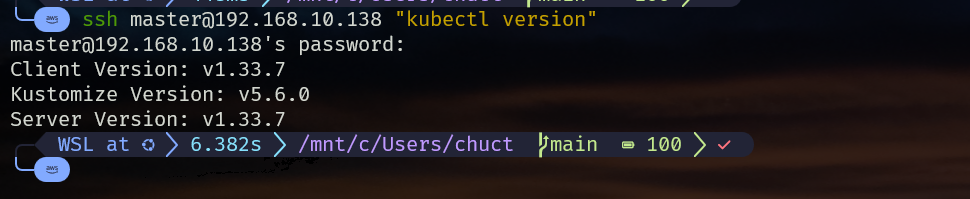
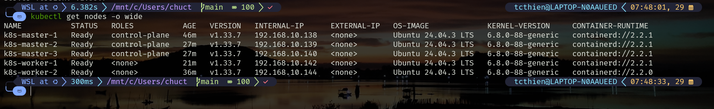
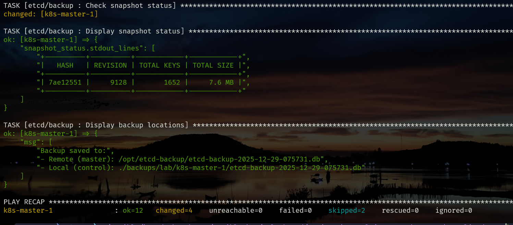
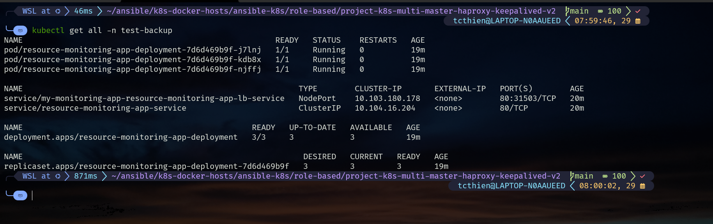
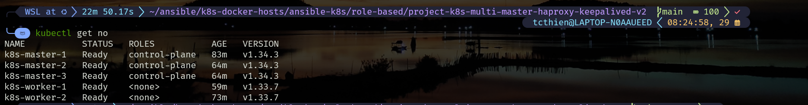
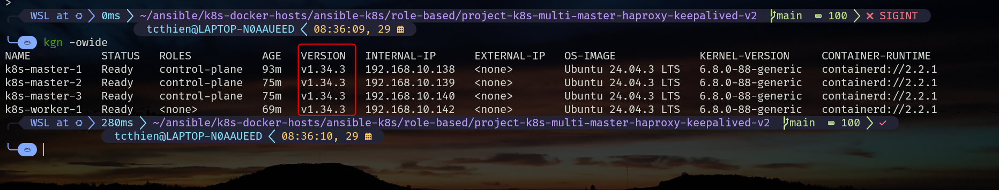
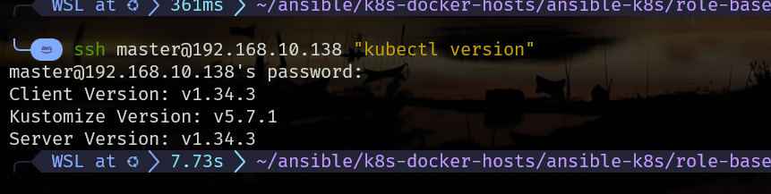
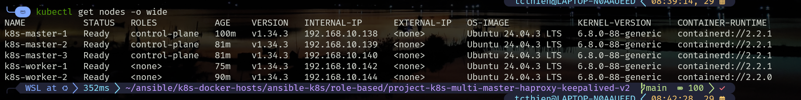
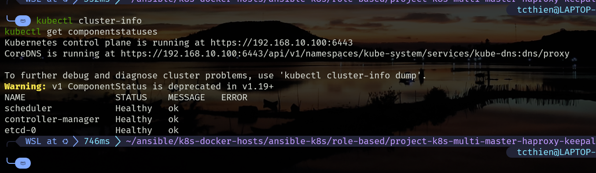

# Ansible Kubernetes Cluster Upgrade Guide

## Table of Contents
1. [Introduction](#1-introduction)
2. [Current Cluster Status](#2-current-cluster-status)
3. [Prerequisites](#3-prerequisites)
4. [Upgrade Execution](#4-upgrade-execution)
5. [Verification Commands](#5-verification-commands)
6. [Upgrade Scenarios](#6-upgrade-scenarios)
7. [Troubleshooting](#7-troubleshooting)
8. [Expected Results](#8-expected-results)
9. [Best Practices](#9-best-practices)
10. [Version Support Matrix](#10-version-support-matrix)

**Appendices:**
- [Appendix A: Available Playbooks](#appendix-a-available-playbooks)
- [Appendix B: Configuration Examples](#appendix-b-configuration-examples)
- [Appendix C: Emergency Procedures](#appendix-c-emergency-procedures)
- [Appendix D: Monitoring Scripts](#appendix-d-monitoring-scripts)

---

## 1. Introduction

### 1.1 Why Upgrade Kubernetes?

**Security & Stability**: Each Kubernetes release includes critical security patches and bug fixes. Running outdated versions exposes clusters to known vulnerabilities.

**Feature Access**: New features, performance improvements, and API enhancements are only available in newer versions.

**Support Lifecycle**: Kubernetes maintains support for only the 3 most recent minor versions (currently 1.35, 1.34, 1.33).

### 1.2 Upgrade Process Overview

1. **Sequential Control Plane**: Upgrade masters one-by-one to maintain API availability
2. **Rolling Worker Upgrade**: Drain, upgrade, and rejoin workers to prevent service disruption
3. **Version Skew Compliance**: Never skip minor versions (1.33 → 1.34 → 1.35)

> **📚 Detailed Theory**: See [Kubernetes Upgrade Theory](kubernetes-upgrade-theory-and-best-practices.md)
> 
> **🔧 Manual Process**: See [Manual Upgrade Guide](manual-kubernetes-upgrade-guide.md)

---

## 2. Current Cluster Status

### 2.1 Before Upgrade (v1.33.x)

#### 2.1.1 Check Cluster Version
```bash
# Verify current Kubernetes version
kubectl version
```



**Figure 2.1**: kubectl version output showing current cluster running v1.33.7 on both client and server components

**Output Explanation:**
- **Client Version**: kubectl binary version (should match or be close to server version)
- **Kustomize Version**: Built-in kustomize tool version for YAML manipulation
- **Server Version**: Kubernetes API server version (this is what we're upgrading)

#### 2.1.2 Check Node Status
```bash
# Check current cluster state
kubectl get nodes -o wide
```



**Figure 2.2**: Cluster nodes showing all masters and workers running v1.33.7 in Ready state

### 2.2 After Upgrade (v1.34.x)
```bash
# Verify upgrade completion
kubectl get nodes -o wide
```

**Expected Output:**
```
NAME           STATUS   ROLES           AGE   VERSION   INTERNAL-IP     OS-IMAGE             KERNEL-VERSION
k8s-master-1   Ready    control-plane   45d   v1.34.3   192.168.10.11   Ubuntu 24.04.1 LTS   6.8.0-51-generic
k8s-master-2   Ready    control-plane   45d   v1.34.3   192.168.10.12   Ubuntu 24.04.1 LTS   6.8.0-51-generic
k8s-master-3   Ready    control-plane   45d   v1.34.3   192.168.10.13   Ubuntu 24.04.1 LTS   6.8.0-51-generic
k8s-worker-1   Ready    <none>          45d   v1.34.3   192.168.10.21   Ubuntu 24.04.1 LTS   6.8.0-51-generic
k8s-worker-2   Ready    <none>          45d   v1.34.3   192.168.10.22   Ubuntu 24.04.1 LTS   6.8.0-51-generic
```

---

## 3. Prerequisites

### 3.1 Update Target Version
Edit `inventories/lab/group_vars/all.yml`:
```yaml
# Target Kubernetes version
kubernetes_upgrade_version: "1.34"
kubernetes_target_version: "v1.34.3"
kubernetes_package_version: "1.34.*"
```

### 3.2 Backup Cluster
```bash
# Create etcd backup before upgrade
ansible-playbook -i inventories/lab playbooks/site-backup.yml
```



**Figure 3.1**: Ansible etcd backup playbook execution showing successful snapshot creation and verification

### 3.3 Deploy Test Application

#### 3.3.1 Resource Monitoring App
```bash
# Deploy comprehensive monitoring application
helm install my-monitoring-app oci://ghcr.io/tranchucthien/helm-charts/resource-monitoring-app \
  --version 0.1.0 \
  -n test-backup \
  --create-namespace
```

**Helm Install Output Explanation:**
- **oci://**: OCI (Open Container Initiative) registry protocol for Helm charts
- **ghcr.io**: GitHub Container Registry hosting the Helm chart
- **--version 0.1.0**: Specific chart version to ensure consistency
- **-n test-backup**: Deploy to dedicated namespace for isolation
- **--create-namespace**: Automatically create namespace if it doesn't exist

#### 3.3.2 Verify Monitoring App
```bash
kubectl get all -n test-backup
```



**Figure 3.2**: Deployed monitoring application showing pods, services, and deployments in test-backup namespace

**Service Types Explanation:**
- **NodePort (31503)**: External access via any node IP + port 31503
- **ClusterIP**: Internal cluster communication only
- **LoadBalancer Service**: Provides external access through NodePort

#### 3.3.3 Test Application Access
```bash
# Test via NodePort (replace with your actual NodePort)
curl -I http://192.168.10.138:31503

# Or test via port-forward for local access
kubectl port-forward -n test-backup svc/my-monitoring-app-resource-monitoring-app-lb-service 5000:80 &
curl -I http://localhost:5000
```

**Expected Response:**
```
HTTP/1.1 200 OK
Server: Werkzeug/2.2.3 Python/3.9.17
Date: Mon, 29 Dec 2025 07:42:01 GMT
Content-Type: text/html; charset=utf-8
Content-Length: 2517
Connection: close
```

**Response Headers Explanation:**
- **HTTP/1.1 200 OK**: Successful response
- **Server**: Python Flask application with Werkzeug WSGI server
- **Content-Type**: HTML response indicating web interface
- **Content-Length**: Response size in bytes

---

## 4. Upgrade Execution

### 4.1 Upgrade Control Plane (Masters)

```bash
# Upgrade all masters sequentially
ansible-playbook -i inventories/lab playbooks/site-upgrade-masters.yml
```

**Process:**
- ✅ Upgrades masters one-by-one
- ✅ API server remains available via HAProxy VIP
- ✅ Automatic etcd backup before each master
- ✅ Version compatibility validation



**Figure 4.1**: Successful completion of masters upgrade showing all control plane nodes upgraded to v1.34

### 4.2 Upgrade Workers with Downtime Testing

#### 4.2.1 Monitor Resource Monitoring App
**Terminal 1 - Start Monitor:**
```bash
# Monitor resource monitoring app during worker upgrade
# Replace 31503 with your actual NodePort
while true; do
  STATUS=$(curl -s -o /dev/null -w '%{http_code}' http://localhost:5000 2>/dev/null || echo 'FAIL')
  RESPONSE_TIME=$(curl -s -o /dev/null -w '%{time_total}' http://localhost:5000 2>/dev/null || echo '0')
  echo "$(date): HTTP_CODE=$STATUS RESPONSE_TIME=${RESPONSE_TIME}s"
  sleep 1
done
```

**Terminal 2 - Execute Worker Upgrade:**
```bash
# Upgrade workers with rolling strategy
ansible-playbook -i inventories/lab playbooks/site-upgrade-workers.yml
```



**Figure 4.2**: Real-time monitoring during worker upgrade showing zero downtime with consistent HTTP 200 responses

**Expected Monitor Output:**
```
Tue Jan  7 10:15:30 UTC 2025: HTTP_CODE=200 RESPONSE_TIME=0.045s
Tue Jan  7 10:15:31 UTC 2025: HTTP_CODE=200 RESPONSE_TIME=0.043s
Tue Jan  7 10:15:32 UTC 2025: HTTP_CODE=200 RESPONSE_TIME=0.041s  # Worker drain starts
Tue Jan  7 10:15:33 UTC 2025: HTTP_CODE=200 RESPONSE_TIME=0.048s  # Pods migrate to other workers
Tue Jan  7 10:15:34 UTC 2025: HTTP_CODE=200 RESPONSE_TIME=0.044s  # No downtime observed
Tue Jan  7 10:15:35 UTC 2025: HTTP_CODE=200 RESPONSE_TIME=0.042s
```

### 4.3 Complete Cluster Upgrade (Alternative)

```bash
# Full automated upgrade (masters + workers)
ansible-playbook -i inventories/lab playbooks/site-upgrade-masters-complete.yml
```

---

## 5. Verification Commands

### 5.1 During Upgrade
```bash
# Monitor cluster status
watch kubectl get nodes -o wide

# Check pod distribution
watch kubectl get pods -o wide

# Monitor control plane
kubectl get pods -n kube-system -l tier=control-plane
```

### 5.2 Post-Upgrade Verification

#### 5.2.1 Verify Kubernetes Version
```bash
# Check upgraded Kubernetes version
kubectl version
```



**Figure 5.1**: kubectl version output after upgrade showing server upgraded to v1.34.3 while client remains v1.33.7

#### 5.2.2 Verify All Nodes Upgraded
```bash
# Verify all nodes upgraded
kubectl get nodes -o wide
```



**Figure 5.2**: All cluster nodes successfully upgraded to v1.34.3 and in Ready state

#### 5.2.3 Check Cluster Health
```bash
# Check cluster health
kubectl cluster-info
kubectl get componentstatuses
```



**Figure 5.3**: Cluster health verification showing all components healthy and API server accessible

#### 5.2.4 Clean Up Test Applications
```bash
# Clean up monitoring app
helm uninstall my-monitoring-app -n test-backup
kubectl delete namespace test-backup
```

---

## 6. Upgrade Scenarios

### 6.1 Scenario 1: Conservative Step-by-Step
```bash
# 1. Backup first
ansible-playbook -i inventories/lab playbooks/site-backup.yml

# 2. Upgrade masters only
ansible-playbook -i inventories/lab playbooks/site-upgrade-masters.yml

# 3. Verify masters are healthy
kubectl get nodes -o wide

# 4. Upgrade workers with monitoring
# Terminal 1: Start monitoring
while true; do curl -s http://localhost:5000 > /dev/null && echo "$(date): OK" || echo "$(date): FAIL"; sleep 1; done

# Terminal 2: Upgrade workers
ansible-playbook -i inventories/lab playbooks/site-upgrade-workers.yml
```

### 6.2 Scenario 2: Full Automated Upgrade
```bash
# Single command upgrade (includes backup)
ansible-playbook -i inventories/lab playbooks/site-upgrade-masters-complete.yml
```

### 6.3 Scenario 3: Dry Run Testing
```bash
# Test upgrade without making changes
ansible-playbook -i inventories/lab playbooks/site-upgrade-masters.yml --check --diff
```

---

## 7. Troubleshooting

### 7.1 Common Issues

#### 7.1.1 Version Skew Warnings (Normal during upgrade)
```bash
# Check API server versions across masters
kubectl get pods -n kube-system -l component=kube-apiserver -o wide

# Expected during upgrade: mixed versions until all masters complete
```

#### 7.1.2 Node Drain Stuck
```bash
# Check what's preventing drain
kubectl get pods -o wide | grep <node-name>

# Force drain if safe
kubectl drain <node> --ignore-daemonsets --delete-emptydir-data --force
```

#### 7.1.3 Application Downtime Detected
```bash
# Check pod distribution
kubectl get pods -o wide

# Verify PodDisruptionBudgets
kubectl get pdb -A

# Scale up replicas if needed
kubectl scale deployment test-nginx --replicas=5
```

### 7.2 Emergency Rollback
```bash
# Restore from etcd backup (last resort)
ansible-playbook -i inventories/lab playbooks/site-restore-etcd.yml
```

---

## 8. Expected Results

### 8.1 ✅ Successful Upgrade Indicators
- All nodes show v1.34.3 in `kubectl get nodes`
- No application downtime during worker upgrade
- All pods running and healthy
- API server accessible via VIP (192.168.10.100:6443)

### 8.2 ⚠️ Warning Signs
- Extended version skew between masters (>10 minutes)
- Application returning 5xx errors during monitoring
- Pods stuck in Pending/Terminating state
- etcd pods not Ready

---

## 9. Best Practices

- ✅ **Always backup etcd before upgrade**
- ✅ **Test application availability during worker upgrade**
- ✅ **Upgrade during maintenance window**
- ✅ **Monitor cluster health throughout process**
- ✅ **Never skip minor versions (1.33 → 1.34 only)**

---

## 10. Version Support Matrix

| Current | Target | Supported | Notes |
|---------|--------|-----------|-------|
| 1.33.x  | 1.34.x | ✅ Yes    | Direct upgrade |
| 1.32.x  | 1.34.x | ❌ No     | Must go 1.32→1.33→1.34 |
| 1.34.x  | 1.35.x | ✅ Yes    | When 1.35 available |

---

## Appendices

### Appendix A: Available Playbooks

```
playbooks/
├── site-upgrade-masters.yml              # Control plane upgrade only
├── site-upgrade-workers.yml              # Worker nodes upgrade only  
├── site-upgrade-masters-complete.yml     # Full cluster upgrade
├── site-backup.yml                       # etcd backup
└── site-restore-etcd.yml                 # Emergency restore
```

### Appendix B: Configuration Examples

#### B.1 Complete group_vars/all.yml Configuration
```yaml
# Kubernetes Version Configuration
kubernetes_upgrade_version: "1.34"
kubernetes_target_version: "v1.34.3"
kubernetes_package_version: "1.34.*"

# Repository Configuration
kubernetes_repo_url: "https://pkgs.k8s.io/core:/stable:/v{{ kubernetes_upgrade_version }}/deb/"
kubernetes_gpg_key: "https://pkgs.k8s.io/core:/stable:/v{{ kubernetes_upgrade_version }}/deb/Release.key"

# Upgrade Behavior
upgrade_strategy: "rolling"
worker_upgrade_batch_size: 1
upgrade_timeout: 600
drain_timeout: 300

# Safety Settings
backup_before_upgrade: true
verify_after_upgrade: true
rollback_on_failure: false
```

### Appendix C: Emergency Procedures

#### C.1 Manual etcd Backup
```bash
# Create manual etcd snapshot
ETCDCTL_API=3 etcdctl \
  --endpoints=https://127.0.0.1:2379 \
  --cacert=/etc/kubernetes/pki/etcd/ca.crt \
  --cert=/etc/kubernetes/pki/etcd/server.crt \
  --key=/etc/kubernetes/pki/etcd/server.key \
  snapshot save /backup/etcd-emergency-$(date +%Y%m%d-%H%M%S).db
```

#### C.2 Force Node Recovery
```bash
# If node is stuck in NotReady state
kubectl delete node <node-name>
# Then rejoin the node to cluster
```

### Appendix D: Monitoring Scripts

#### D.1 Comprehensive Health Monitor
```bash
#!/bin/bash
# health-monitor.sh
while true; do
  echo "=== $(date) ==="
  echo "Nodes: $(kubectl get nodes --no-headers | wc -l) total"
  echo "Ready: $(kubectl get nodes --no-headers | grep -c Ready)"
  echo "API: $(curl -s -k https://192.168.10.100:6443/healthz)"
  echo "App: $(curl -s -o /dev/null -w '%{http_code}' http://localhost:5000)"
  echo "---"
  sleep 5
done
```

#### D.2 Upgrade Progress Tracker
```bash
#!/bin/bash
# upgrade-progress.sh
echo "Tracking upgrade progress..."
while true; do
  echo "$(date): Masters upgraded: $(kubectl get nodes -l node-role.kubernetes.io/control-plane --no-headers | grep -c v1.34)"
  echo "$(date): Workers upgraded: $(kubectl get nodes -l '!node-role.kubernetes.io/control-plane' --no-headers | grep -c v1.34)"
  sleep 10
done
```

---

This guide demonstrates zero-downtime Kubernetes upgrades using Ansible automation while maintaining service availability through proper rolling update strategies.