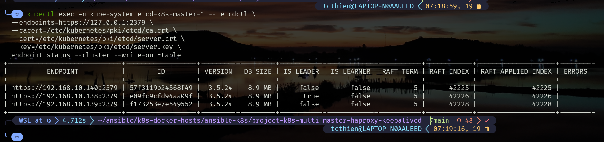
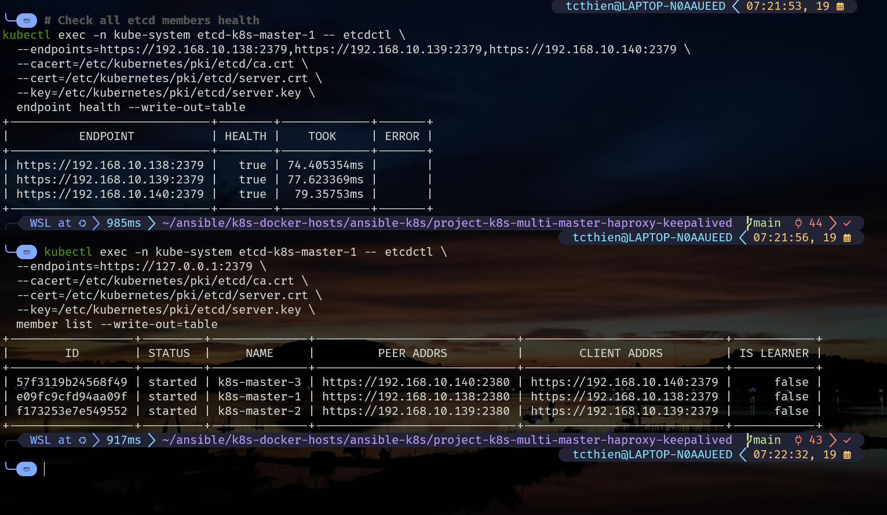
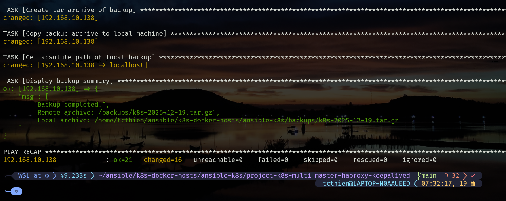
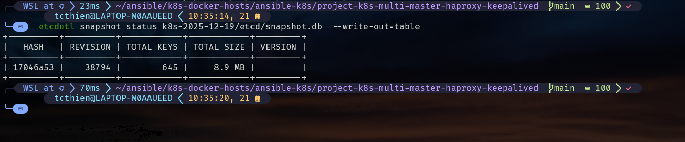
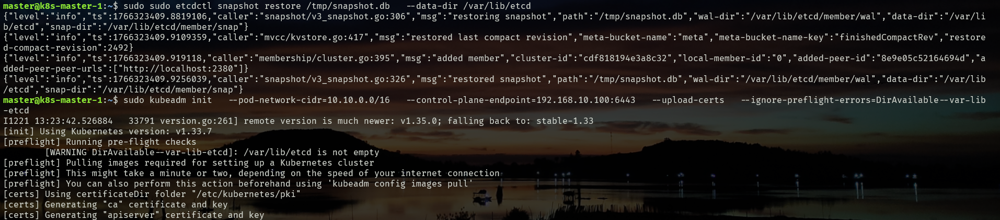
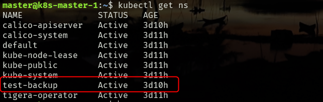

# etcd Backup & Restore Guide (Ansible)

## **Mục Lục**

- [Cluster Overview](https://vscode-remote+wsl-002bubuntu.vscode-resource.vscode-cdn.net/home/tcthien/ansible/k8s-docker-hosts/ansible-k8s/docs/etcd-backup-restore/etcd-backup-restore.md#cluster-overview)
- [Use Cases: etcd vs Velero](https://vscode-remote+wsl-002bubuntu.vscode-resource.vscode-cdn.net/home/tcthien/ansible/k8s-docker-hosts/ansible-k8s/docs/etcd-backup-restore/etcd-backup-restore.md#use-cases-etcd-vs-velero)
- [Manual Backup](https://vscode-remote+wsl-002bubuntu.vscode-resource.vscode-cdn.net/home/tcthien/ansible/k8s-docker-hosts/ansible-k8s/docs/etcd-backup-restore/etcd-backup-restore.md#manual-backup)
- [Automated Backup](https://vscode-remote+wsl-002bubuntu.vscode-resource.vscode-cdn.net/home/tcthien/ansible/k8s-docker-hosts/ansible-k8s/docs/etcd-backup-restore/etcd-backup-restore.md#automated-backup)
- [Restore Process](https://vscode-remote+wsl-002bubuntu.vscode-resource.vscode-cdn.net/home/tcthien/ansible/k8s-docker-hosts/ansible-k8s/docs/etcd-backup-restore/etcd-backup-restore.md#restore-process)

## **Cluster Overview**

### **Current HA Cluster Setup**

| Component | IP Address | Role |
| --- | --- | --- |
| Master 1 | 192.168.10.138 | etcd + control plane |
| Master 2 | 192.168.10.139 | etcd + control plane |
| Master 3 | 192.168.10.140 | etcd + control plane |
| Worker 1 | 192.168.10.142 | Compute node |
| HAProxy Primary | 192.168.10.141 | Load balancer + Keepalived |
| HAProxy Backup | 192.168.10.143 | Backup load balancer |
| VIP | 192.168.10.100 | Virtual IP (Keepalived) |

### **etcd Cluster Architecture**

```
etcd Cluster (3 nodes - Quorum 2/3):
├── k8s-master-1 (192.168.10.138) - Leader/Follower
├── k8s-master-2 (192.168.10.139) - Leader/Follower
└── k8s-master-3 (192.168.10.140) - Leader/Follower

Data Sync: Raft consensus protocol
```

## **Use Cases: etcd vs Velero**

### **Khi Nào Dùng etcd Backup?**

**✅ etcd backup cho Disaster Recovery:**

- 🔥 Mất hoàn toàn cluster (hardware failure, datacenter down)
- 🏗️ Rebuild cluster từ đầu trên infrastructure mới
- 🔄 Major cluster migration (cloud provider, datacenter)
- 💥 etcd corruption không sửa được

**❌ KHÔNG dùng etcd backup cho:**

- Restore individual applications → Dùng Velero
- Backup application data/volumes → Dùng Velero
- Accidental deletion → Dùng Velero
- Cross-cluster workload migration → Dùng Velero

### **So Sánh Nhanh**

| Scenario | Solution |
| --- | --- |
| Lost entire cluster | etcd backup |
| Accidental app deletion | Velero |
| Application rollback | Velero |
| Hardware failure | etcd backup |
| Migrate specific apps | Velero |
| Cluster migration | etcd backup + Velero |

## **Manual Backup**

### **etcd Backup Theory cho HA Cluster**

**Tại sao chỉ cần backup từ 1 etcd node:**

1. **Raft Consensus Protocol**:
    - etcd sử dụng Raft để sync data giữa các nodes
    - Tất cả nodes có **identical data** tại mọi thời điểm
    - Backup từ bất kỳ node nào đều cho kết quả giống nhau
2. **Leader Election**:
    - 1 node là Leader (handle writes)
    - 2 nodes là Followers (replicate data)
    - Data được replicate đồng bộ trước khi commit
3. **Backup Strategy**:
    - **Recommended**: Backup từ Leader node (performance tốt nhất)
    - **Alternative**: Backup từ bất kỳ Follower nào
    - **Avoid**: Backup đồng thời từ nhiều nodes (unnecessary)

```bash
# Kiểm tra Leader node
kubectl exec -n kube-system etcd-k8s-master-1 -- etcdctl \
  --endpoints=https://127.0.0.1:2379 \
  --cacert=/etc/kubernetes/pki/etcd/ca.crt \
  --cert=/etc/kubernetes/pki/etcd/server.crt \
  --key=/etc/kubernetes/pki/etcd/server.key \
  endpoint status --write-out=table
```


*Hình 1: Kiểm tra etcd leader status - Master 1 đang là leader node*

### **Check etcd Health**

```bash
# Check all etcd members health
kubectl exec -n kube-system etcd-k8s-master-1 -- etcdctl \
  --endpoints=https://192.168.10.138:2379,https://192.168.10.139:2379,https://192.168.10.140:2379 \
  --cacert=/etc/kubernetes/pki/etcd/ca.crt \
  --cert=/etc/kubernetes/pki/etcd/server.crt \
  --key=/etc/kubernetes/pki/etcd/server.key \
  endpoint health --write-out=table

# Check member list and leader
kubectl exec -n kube-system etcd-k8s-master-1 -- etcdctl \
  --endpoints=https://127.0.0.1:2379 \
  --cacert=/etc/kubernetes/pki/etcd/ca.crt \
  --cert=/etc/kubernetes/pki/etcd/server.crt \
  --key=/etc/kubernetes/pki/etcd/server.key \
  member list --write-out=table
```


*Hình 2: Kiểm tra health status của tất cả etcd members trong cluster*

### **Create Backup**

```bash
# Create backup directory
sudo mkdir -p /opt/etcd-backup/manual

# Find available etcd pod (any master node)
ETCD_POD=$(kubectl get pods -n kube-system -l component=etcd --no-headers | head -1 | awk '{print $1}')
echo "Using etcd pod: $ETCD_POD"

# Create snapshot (backup từ bất kỳ etcd node nào available)
kubectl exec -n kube-system $ETCD_POD -- etcdctl \
  --endpoints=https://127.0.0.1:2379 \
  --cacert=/etc/kubernetes/pki/etcd/ca.crt \
  --cert=/etc/kubernetes/pki/etcd/server.crt \
  --key=/etc/kubernetes/pki/etcd/server.key \
  snapshot save /tmp/etcd-backup-$(date +%Y-%m-%d-%H-%M).db

# Copy to host
kubectl cp kube-system/$ETCD_POD:/tmp/etcd-backup-$(date +%Y-%m-%d-%H-%M).db \
  /opt/etcd-backup/manual/etcd-backup-$(date +%Y-%m-%d)-manual.db
```

### **Ansible Playbook**

```bash
ansible-playbook -i inventory-lab playbooks/21-backup-etcd.yml
```


*Hình 3: Kết quả chạy Ansible playbook backup etcd thành công*

### **Verify Backup**

```bash
 etcdutl snapshot status k8s-2025-12-19/etcd/snapshot.db  --write-out=table
```


*Hình 4: Verify backup file integrity với etcdutl snapshot status*

### **Configure Crontab**

```bash
# Daily backup at 2AM
sudo crontab -e
# Add: 0 2 * * * /opt/etcd-backup/backup-script.sh >> /var/log/etcd-backup.log 2>&1
```

### **Ansible Playbook**

```bash
ansible-playbook -i inventory-lab playbooks/07-etcd-backup-automated.yaml
```

## **Restore Process**

### **⚠️ Cảnh Báo Quan Trọng**

**etcd restore CHỈ dùng khi:**

- Mất hoàn toàn cluster
- Rebuild cluster mới
- Disaster recovery

**KHÔNG restore vào cluster đang chạy!**

### **Restore Theory**

**Simplified Restore Process:**

1. **Restore snapshot trên 1 master node** để tạo single-node cluster
2. **Start etcd** trên master đó với restored data
3. **Join các masters khác** vào cluster như bình thường
4. etcd cluster sẽ replicate data tới các nodes mới

**⚠️ Quan trọng:**

- Chỉ cần restore trên 1 node (master đầu tiên)
- Các masters khác join vào như cluster mới
- Data sẽ được replicate tự động

### **Pre-Restore**

```bash
# Verify backup integrity
etcdutl snapshot status /opt/etcd-backup/daily/etcd-backup-2025-12-19-02-00.db

# Document current state (if accessible)
kubectl get nodes
kubectl get ns
```

### 

### **Restore Steps (Simplified)**

### **Step 1: Chuẩn Bị Master Mới**

```bash
# Cài đặt dependencies trên master mới
ansible-playbook -i inventory playbooks/01-common.yaml --limit 192.168.10.138

```

### **Step 2: Restore và Init Cluster**

**Automated (Recommended):**

```bash
# Sử dụng playbook tự động
ansible-playbook -i inventory playbooks/restore-and-init.yml --limit 192.168.10.138

```

**Manual:**

```bash
# Copy backup file to master
scp k8s-2025-12-19/etcd/snapshot.db master@192.168.10.138:/tmp/

# Restore etcd snapshot
sudo etcdutl snapshot restore /tmp/snapshot.db \
  --data-dir /var/lib/etcd

# Init cluster mới
sudo kubeadm init \
  --pod-network-cidr=10.10.0.0/16 \
  --control-plane-endpoint=192.168.10.100:6443 \
  --upload-certs \
  --ignore-preflight-errors=DirAvailable--var-lib-etcd

# Setup kubectl
mkdir -p $HOME/.kube
sudo cp /etc/kubernetes/admin.conf $HOME/.kube/config
sudo chown $(id -u):$(id -g) $HOME/.kube/config

# Check cluster status
kubectl get all -A
```

### 


*Hình 5: Kết quả thực hiện etcd snapshot restore và kubeadm init thành công*


*Hình 6: Xác nhận các namespace từ cluster cũ đã được restore thành công*

### **Important Notes**

**⚠️ Critical Points:**

1. **Fresh Infrastructure**: Restore trên master mới, không sửa old cluster
2. **New Cluster Init**: Dùng `kubeadm init` với restored etcd data
3. **Check Workloads**: Luôn kiểm tra `kubectl get all -A` trước và sau restore
4. **Automated**: Sử dụng playbook `restore-and-init.yml` cho đơn giản

**🔄 Recovery Time:** 25-45 phút

```

```

---

## **Best Practices**

### **Backup Strategy**

```
Production Setup:
├── etcd backup (disaster recovery)
│   ├── Daily: 2AM (30 days retention)
│   └── Pre-upgrade: Manual
└── Velero (operational backup)
    ├── Applications: Per namespace
    └── PV snapshots: Daily
```

### **Key Points**

- **etcd backup = Disaster recovery only**
- **Fresh infrastructure**: Restore trên masters mới, không sửa old cluster
- **New cluster init**: Dùng kubeadm init với restored etcd data
- **Automated restore**: Sử dụng playbook `restore-and-init.yml`
- **Check workloads**: Luôn kiểm tra `kubectl get all -A` trước và sau restore
- Test restore process regularly
- Store backups in multiple locations
- Document recovery procedures