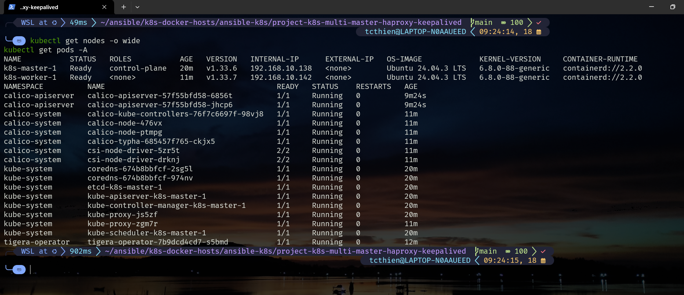
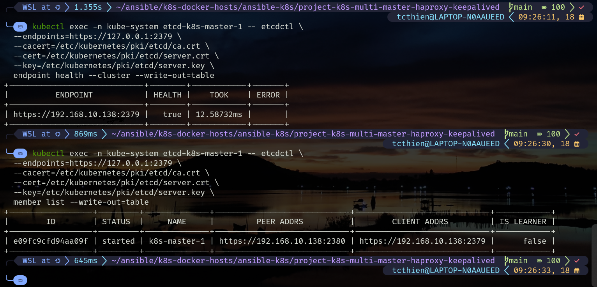
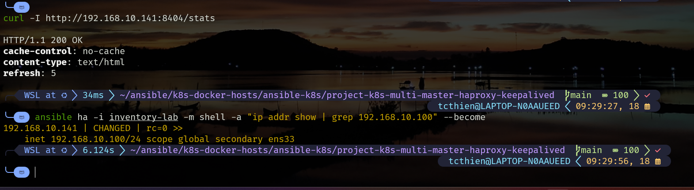
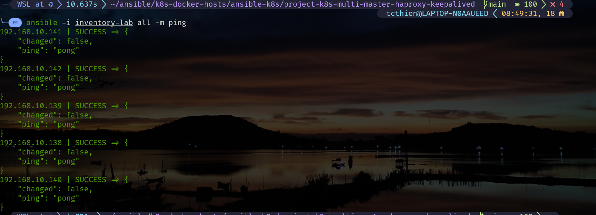
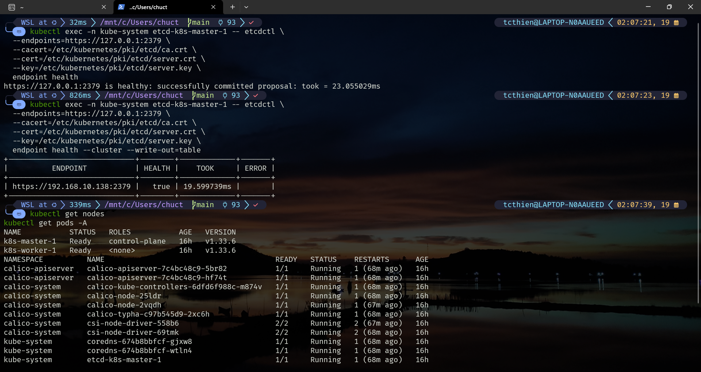
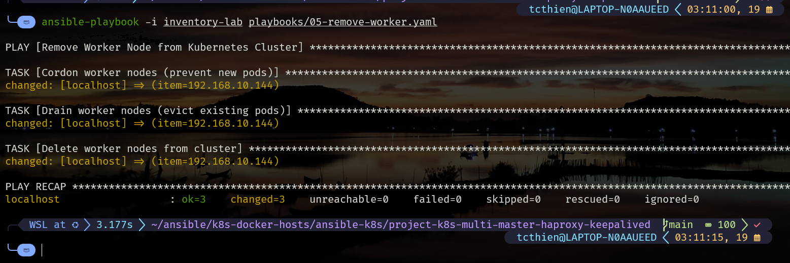
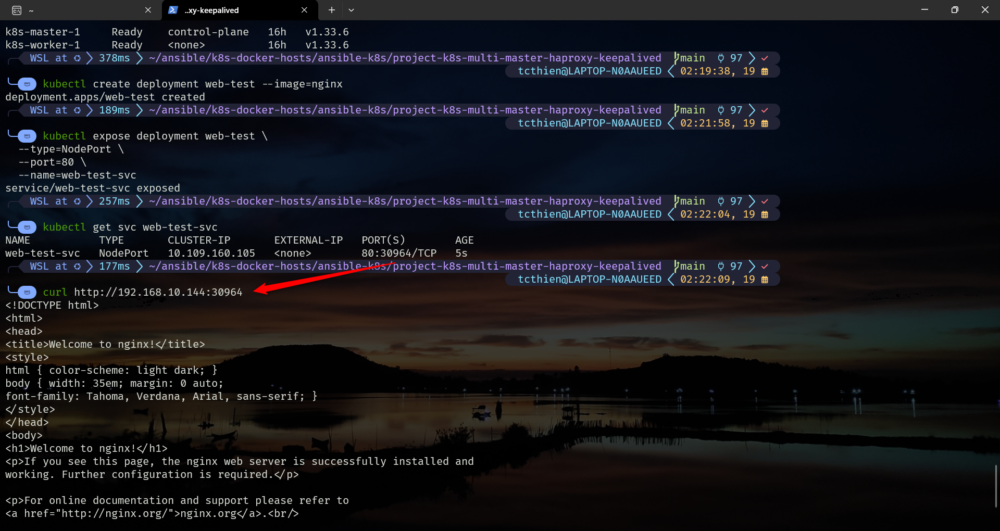
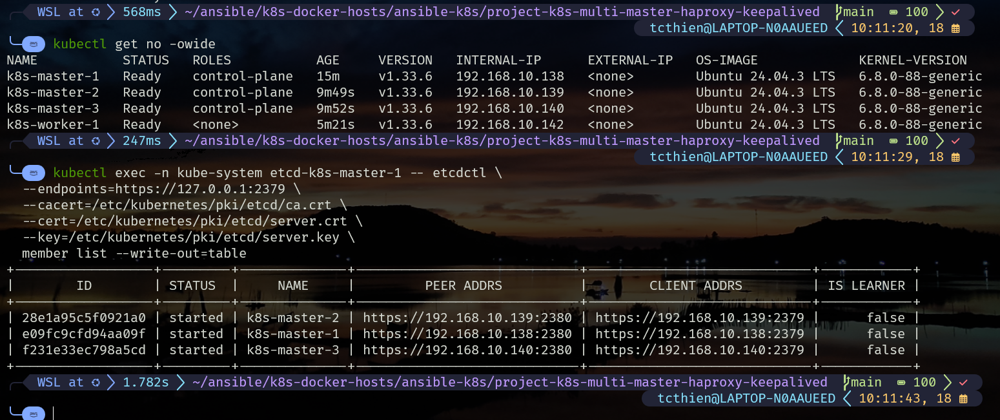
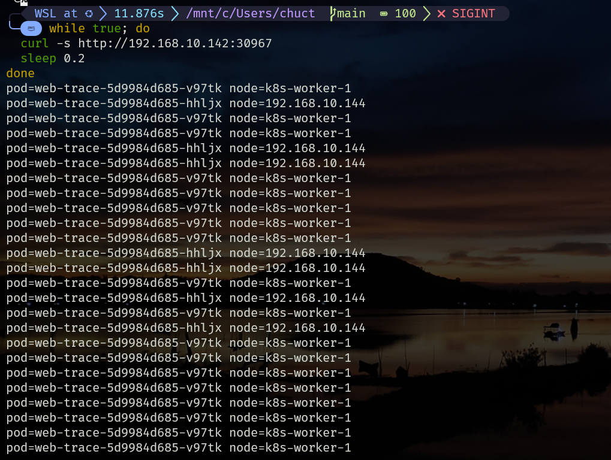
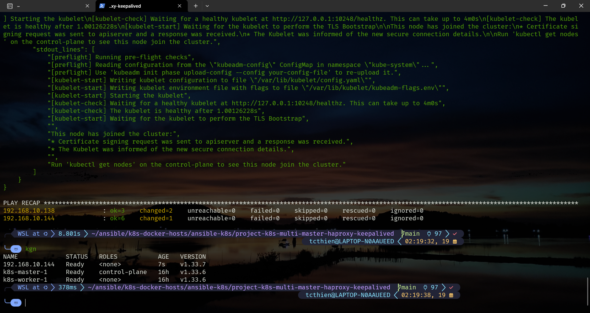

# Kubernetes Cluster Operations & Testing Guide (Ansible)

## Table of Contents
- [Part 1: Prerequisites and Pre-flight Checks](#part-1-prerequisites-and-pre-flight-checks)
- [Part 2: Master Node Operations](#part-2-master-node-operations)
- [Part 3: Worker Node Operations](#part-3-worker-node-operations)

## Part 1: Prerequisites and Pre-flight Checks

### Infrastructure Deployment Overview

#### Phase 1 - Initial Cluster

| Component | IP Address | Role |
|-----------|------------|------|
| Master | 192.168.10.138 | etcd embedded |
| Worker | 192.168.10.142 | Compute node |
| HAProxy Primary | 192.168.10.141 | Load balancer + Keepalived |
| HAProxy Backup | 192.168.10.143 | Backup load balancer |
| VIP | 192.168.10.100 | Virtual IP (Keepalived) |

#### Phase 2 - Scale-up

| Component | IP Address | Purpose |
|-----------|------------|----------|
| Master 2 | 192.168.10.139 | Additional control plane |
| Master 3 | 192.168.10.140 | Additional control plane |
| Worker 2 | 192.168.10.144 | Additional compute (optional) |
| etcd cluster | 3 nodes | Quorum 2/3 |

### Initial Cluster Status Check

```bash
# Check initial cluster status
kubectl get nodes -o wide
kubectl get pods -A

# Check etcd health (single node)
kubectl exec -n kube-system etcd-$(hostname) -- etcdctl \
  --endpoints=https://127.0.0.1:2379 \
  --cacert=/etc/kubernetes/pki/etcd/ca.crt \
  --cert=/etc/kubernetes/pki/etcd/server.crt \
  --key=/etc/kubernetes/pki/etcd/server.key \
  endpoint health
```


*Figure 1: Initial cluster status*


*Figure 2: etcd cluster status*

```bash
# Check HAProxy status
curl -I http://192.168.10.141:8404/stats

# Check VIP status
ansible ha -i inventory-lab -m shell -a "ip addr show | grep 192.168.10.100" --become
```


*Figure 3: HAProxy stats and VIP status*

### SSH Connection Verification

```bash
# Test SSH connection to all nodes
ansible all -i inventory -m ping

# Test specific groups
ansible masters -i inventory -m ping
ansible workers -i inventory -m ping
ansible haproxy -i inventory -m ping
```


*Figure 4: SSH connection test results to all nodes*

## Part 2: Master Node Operations

### 2.1. Adding New Master (Scale-up)

#### Master Join Process Theory

**Why masters need to join in sequence:**

1. **etcd Cluster Formation**: etcd needs to create cluster with quorum (majority)
2. **Certificate Distribution**: Certificates must be shared between masters
3. **API Server Registration**: Each master needs to register with load balancer
4. **Control Plane Components**: kubelet, kube-proxy, scheduler need sync

**Required components for Master Join:**

- **Certificate Key**: To decrypt and share certificates
- **Join Token**: Authentication token for cluster
- **CA Certificate Hash**: Verify cluster identity
- **Control Plane Endpoint**: VIP address (192.168.10.100:6443)

**Master Join Process:**

1. **Certificate Upload**: First master uploads certs with certificate-key
2. **Token Generation**: Create join token with certificate-key
3. **Join Command**: New master uses join command with --control-plane flag
4. **etcd Member Add**: Automatically add to etcd cluster
5. **Component Sync**: Sync kubelet, kube-proxy configs

#### Implementation Process

```bash
# Step 1: Check connectivity
ansible new_masters -i inventory-lab -m ping

# Step 2: Install prerequisites
ansible-playbook -i inventory-lab playbooks/01-common.yaml --limit new_masters

# Step 3: Join to cluster
ansible-playbook -i inventory-lab playbooks/03-join-master.yaml --limit 192.168.10.138:new_masters

# Step 4: Verify results
kubectl get nodes -o wide
kubectl get pods -A
kubectl exec -n kube-system etcd-k8s-master-1 -- etcdctl \
  --endpoints=https://127.0.0.1:2379 \
  --cacert=/etc/kubernetes/pki/etcd/ca.crt \
  --cert=/etc/kubernetes/pki/etcd/server.crt \
  --key=/etc/kubernetes/pki/etcd/server.key \
  member list --write-out=table
```


*Figure 5: Successful master nodes join result*

### 2.2. Removing Master (Scale-down)

#### Master Removal Process Theory

**Why masters need to be removed in sequence:**

1. **etcd Consensus**: etcd uses Raft algorithm, need to maintain quorum (majority)
2. **API Server Load Balancing**: HAProxy needs to update backend servers
3. **Certificate Management**: Cleanup certificates and keys
4. **Resource Cleanup**: Remove kubelet data, CNI configs

**Important sequence:**

- Remove from etcd cluster FIRST (maintain quorum)
- Remove from Kubernetes cluster AFTER
- Cleanup node LAST

#### Manual Process (Reference)

```bash
# Get member ID
MEMBER_ID=$(kubectl exec -n kube-system etcd-k8s-master-1 -- etcdctl \
  --endpoints=https://127.0.0.1:2379 \
  --cacert=/etc/kubernetes/pki/etcd/ca.crt \
  --cert=/etc/kubernetes/pki/etcd/server.crt \
  --key=/etc/kubernetes/pki/etcd/server.key \
  member list | grep master-3 | cut -d',' -f1)

# Remove member
kubectl exec -n kube-system etcd-k8s-master-1 -- etcdctl \
  --endpoints=https://127.0.0.1:2379 \
  --cacert=/etc/kubernetes/pki/etcd/ca.crt \
  --cert=/etc/kubernetes/pki/etcd/server.crt \
  --key=/etc/kubernetes/pki/etcd/server.key \
  member remove $MEMBER_ID
```

#### Automated Process

```bash
# Remove from cluster
ansible-playbook -i inventory-lab playbooks/04-remove-master.yaml 

# Reset nodes
ansible-playbook -i inventory-lab playbooks/99-k8s-reset-node.yml --limit remove_masters 
```

#### Validation

```bash
# Check etcd quorum (should be odd number)
kubectl exec -n kube-system etcd-k8s-master-1 -- etcdctl \
  --endpoints=https://127.0.0.1:2379 \
  --cacert=/etc/kubernetes/pki/etcd/ca.crt \
  --cert=/etc/kubernetes/pki/etcd/server.crt \
  --key=/etc/kubernetes/pki/etcd/server.key \
  endpoint health

# Test cluster resilience
kubectl get nodes
kubectl get pods -A
```


*Figure 6: Master nodes removal result*

## Part 3: Worker Node Operations

### 3.1. Adding New Worker

```bash
# Run common setup
ansible-playbook -i inventory-lab playbooks/01-common.yaml --limit new_workers

# Join worker to cluster
ansible-playbook -i inventory-lab playbooks/03-join-worker.yaml --limit 192.168.10.138:new_workers
```


*Figure 7: Worker nodes addition result*

#### Validation

```bash
# Create Deployment
kubectl create deployment web-test --image=nginx

# Expose Deployment as NodePort Service
kubectl expose deployment web-test \
  --type=NodePort \
  --port=80 \
  --name=web-test-svc

# Get Service and NodePort
kubectl get svc web-test-svc

# Test connectivity from Node (Host)
curl http://<NODE-IP>:<NODEPORT>

# Cleanup
kubectl delete deployment web-test
kubectl delete svc web-test-svc
```


*Figure 8: Service connectivity test on worker nodes*

### 3.2. Removing Worker (Decommissioning)

#### Safe Worker Removal Theory

**1. Cordon:**
- **Purpose**: Prevent scheduler from creating new pods on target node
- **Mechanism**: Mark node as "unschedulable"
- **Impact**: Existing pods continue running, but no new pods
- **Command**: `kubectl cordon <node-name>`

**2. Drain:**
- **Purpose**: Safely move all pods from node
- **Mechanism**: Evict pods and reschedule to other nodes
- **Impact**: Node becomes "empty" and ready for removal
- **Command**: `kubectl drain <node-name> --ignore-daemonsets --delete-emptydir-data --force`

**3-Step Worker Removal Process:**

```
1. CORDON  → Prevent new pods
2. DRAIN   → Move existing pods
3. DELETE  → Remove node from cluster
```

#### Method Comparison

**❌ Direct deletion (kubectl delete node) causes:**

- **Service Disruption**: Pods terminated abruptly
- **Data Loss**: EmptyDir volumes lost
- **Connection Drops**: Active connections interrupted
- **Resource Waste**: Pods not rescheduled

**✅ Cordon + Drain + Delete ensures:**

- **Zero Downtime**: Pods moved before removal
- **Data Safety**: Graceful termination with cleanup
- **Service Continuity**: Pods rescheduled to other nodes
- **Resource Optimization**: Resources redistributed

#### Automated Process

```bash
# Run remove worker playbook (auto cordon + drain + delete)
ansible-playbook -i inventory-lab playbooks/05-remove-worker.yaml

# Playbook will perform:
# 1. Cordon nodes (prevent new pods)
# 2. Drain nodes (move existing pods)
# 3. Delete nodes from cluster

# Reset Kubernetes configuration on node
ansible-playbook -i inventory-lab playbooks/99-k8s-reset-node.yml --limit remove_workers
```

#### Validation

```bash
while true; do
  curl -s http://192.168.10.142:30967
  sleep 0.2
done
```


*Figure 9: Worker removal process with zero downtime*


*Figure 10: etcd cluster status after operations*

---

## Summary

This document provides detailed guidance on:

- **Pre-flight checks**: Prerequisites verification
- **Master operations**: Safe master node addition/removal
- **Worker operations**: Worker node addition/removal with zero downtime
- **Validation**: Verification and confirmation of operations

All operations are automated using Ansible playbooks to ensure consistency and reduce human error.