# Kiểm thử tính "khả dụng cao" cho cụm Kubernetes

Tài liệu này mô tả chi tiết toàn bộ quy trình kiểm thử HA, bao gồm:

- Kiểm tra trạng thái nội bộ của Etcd (thông qua `kubectl exec`)
- Triển khai workload để theo dõi real-world behavior
- Thực thi các kịch bản kiểm thử
- Phân tích hành vi Etcd quorum, API server failover và data-plane resiliency

**Environment:** Kubernetes v1.33 (Multi-Master, Stacked Etcd)

**Architecture:** 3 Control Plane Nodes (Masters), 1 Worker Node, 2 HAProxy/Keepalived Load Balancer

```markdown
## 🏗️ Architecture Overview
                    ┌─────────────────┐
                    │   Virtual IP    │
                    │ 192.168.10.100  │ ← Keepalived VIP
                    └─────────┬───────┘
                              │
          ┌───────────────────┼───────────────────┐
          │                   │                   │
    ┌─────▼─────┐       ┌─────▼─────┐       ┌─────▼─────┐
    │ HAProxy1  │       │ HAProxy2  │       │ HAProxy3  │
    │ (MASTER)  │       │ (BACKUP)  │       │ (BACKUP)  │
    │ .141      │       │ .143      │       │ (future)  │
    └─────┬─────┘       └─────┬─────┘       └─────┬─────┘
          │                   │                   │
          └───────────────────┼───────────────────┘
                              │
          ┌───────────────────┼───────────────────┐
          │                   │                   │
    ┌─────▼─────┐       ┌─────▼─────┐       ┌─────▼─────┐
    │ Master1   │       │ Master2   │       │ Master3   │
    │ etcd1     │       │ etcd2     │       │ etcd3     │
    │ .138      │       │ .139      │       │ .140      │
    └───────────┘       └───────────┘       └───────────┘
          │                   │                   │
          └───────────────────┼───────────────────┘
                              │
                    ┌─────────▼─────────┐
                    │    Worker Nodes   │
                    │      .142         │
                    └───────────────────┘
```

---

# **PHẦN 1 — BASELINE HEALTH CHECK**

Đầu tiên cần xác minh trạng thái baseline của cụm Kubernetes để đảm bảo mọi thành phần đang hoạt động ổn định.

---

## **1. Validate Node & System Pod Health**

**Expectation:** Cả 3 etcd pods phải ở trạng thái `Running` trên 3 control-plane nodes khác nhau.

```bash
# Kiểm tra danh sách Node
kubectl get nodes -o wide

# Kiểm tra các Pod etcd đang chạy trong namespace kube-system
kubectl get pods -n kube-system -l component=etcd -o wide
```

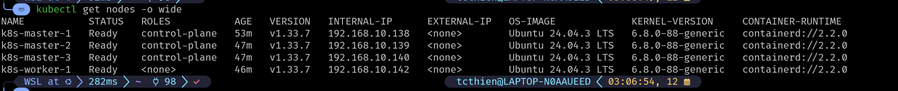

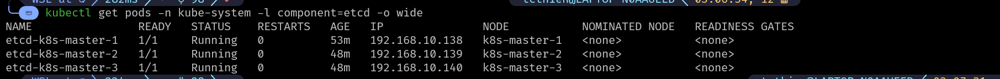

---

## **2. Kiểm tra Etcd (kubectl exec direct inspection)**

Thay vì cài `etcdctl` trên host, có thể dùng cách **exec trực tiếp vào container của etcd**.

### **2.1. Kiểm tra danh sách etcd members**

```bash
kubectl exec -n kube-system etcd-k8s-master-1 -- etcdctl \
  --endpoints=https://k8s-master-1:2379,https://k8s-master-2:2379,https://k8s-master-3:2379 \
  --cacert=/etc/kubernetes/pki/etcd/ca.crt \
  --cert=/etc/kubernetes/pki/etcd/server.crt \
  --key=/etc/kubernetes/pki/etcd/server.key \
  member list --write-out=table
```

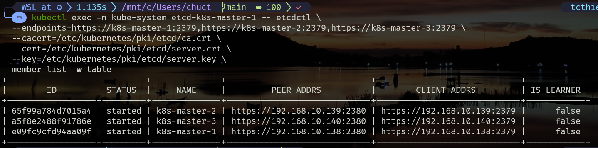

### **2.2. Kiểm tra Leader và Raft health**

```bash
kubectl exec -n kube-system etcd-k8s-master-1 -- etcdctl \
  --endpoints=https://k8s-master-1:2379,https://k8s-master-2:2379,https://k8s-master-3:2379 \
  --cacert=/etc/kubernetes/pki/etcd/ca.crt \
  --cert=/etc/kubernetes/pki/etcd/server.crt \
  --key=/etc/kubernetes/pki/etcd/server.key \
  endpoint status --write-out=table
```

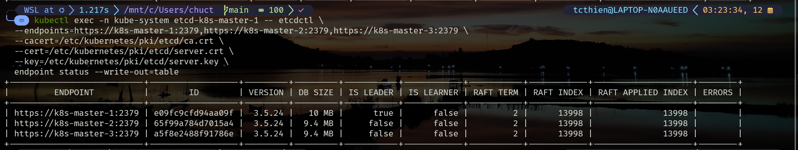

---

# **PHẦN 2 — DEPLOY WORKLOAD**

## **1. Deploy a sample workload**

```bash
kubectl create deployment nginx-ha-test \
  --image=nginx:latest \
  --replicas=3

kubectl expose deployment nginx-ha-test \
  --port=80 \
  --type=NodePort \
  --name=nginx-service
```

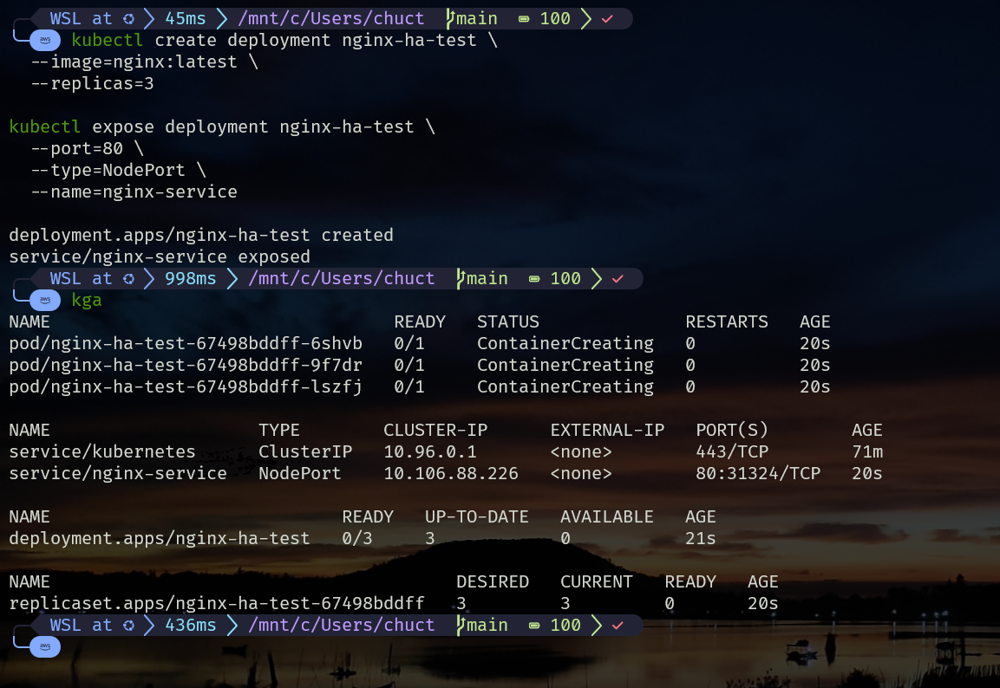

---

# **PHẦN 3 — SCENARIO 1: CONTROL-PLANE FAILURE & ETCD LEADER FAILOVER**

**Objective:** Xác minh hành vi Etcd leader failover, HAProxy, Kubernetes API khi mất 1 master.

---

## **1. Action: Shutdown Master Node đang giữ vai trò Etcd Leader**

```bash
ssh master@k8s-master-1 "sudo poweroff"
```

(*Thay `k8s-master-1` bằng leader thực tế.*)

---

## **2. Post-failure Verification**

**Expected:** Leader mới phải được bầu, cluster vẫn hoạt động ổn định.

SSH vào một Master còn sống:

```bash
kubectl exec -n kube-system etcd-k8s-master-2 -- etcdctl \
  --endpoints=https://k8s-master-1:2379,https://k8s-master-2:2379,https://k8s-master-3:2379 \
  --cacert=/etc/kubernetes/pki/etcd/ca.crt \
  --cert=/etc/kubernetes/pki/etcd/server.crt \
  --key=/etc/kubernetes/pki/etcd/server.key \
  endpoint status --write-out=table
```

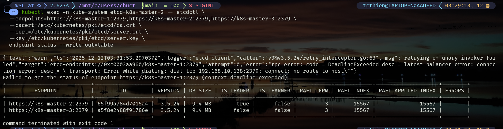

- Etcd báo lỗi với k8s-master-1 → Đây là dấu hiệu đúng khi Master Leader tắt
    
    ```bash
    rpc error: ... dial tcp 192.168.10.138:2379: connect: no route to host
    Failed to get the status of endpoint https://k8s-master-1:2379
    ```
    
- Kết quả Etcd endpoint status — Leader đã failover thành công: **Etcd đã bầu leader mới là `k8s-master-2`.** Điều này khẳng định **etcd quorum vẫn còn**:
    - Số node etcd: 3
    - Số node alive: 2
    
    → **Cụm etcd vẫn hoạt động tốt**, không mất dữ liệu, không mất quyền ghi.

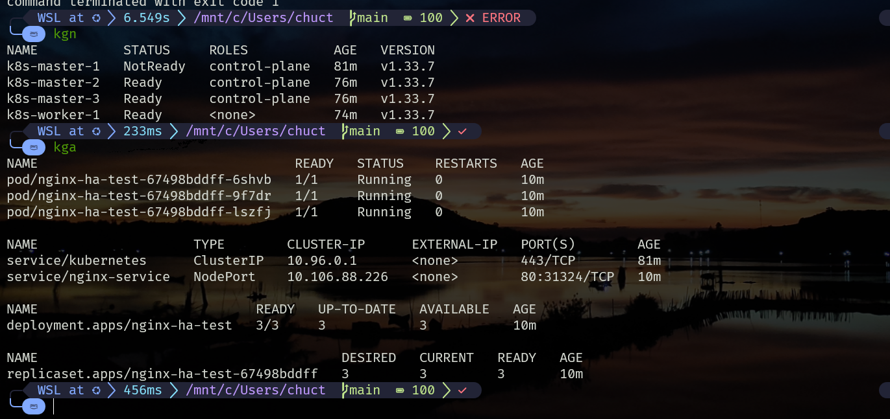

- K8s Node Status: `k8s-master-1` bị shutdown → chuyển sang `NotReady`
- Ứng dụng Nginx HA Test vẫn chạy ổn — chứng minh toàn cluster không bị ảnh hưởng

## **3. Kết luận Chung**

Sau khi shutdown 1 master (leader etcd), đã chứng minh được:

### **✔ 1. Etcd leader failover hoạt động chính xác**

- Node dead → leader tự động bầu lại
- Leader mới là `k8s-master-2`
- Quorum vẫn 2/3 nên cụm etcd vẫn ghi/đọc được

### **✔ 2. Control-plane HA vẫn hoạt động**

- kube-apiserver tiếp tục phục vụ qua HAProxy
- Các control-plane component không bị gián đoạn

### **✔ 3. Kubernetes cluster vẫn ổn định**

- Không có pod restart
- Không có sự cố scheduling
- Service vẫn hoạt động

---

# **PHẦN 4 — SCENARIO 2: QUORUM LOSS / SPLIT-BRAIN PROTECTION**

**Objective:** Kiểm tra behavior khi Etcd mất quorum (1/3 member còn sống). 

---

## **1. Action: Shutdown thêm 1 control-plane node nữa**

```bash
ssh user@k8s-master-2 "sudo poweroff"
```

---

## **2. Analysis**

- **Etcd Quorum Requirement:**
    
    ```
    Quorum = ⌊N/2⌋ + 1 = 2
    ```
    
    Hiện chỉ còn 1 node → **mất quorum**.
    
- **Etcd Behavior:**
    - Reject mọi write operation: vì không thể đạt quorum để bầu leader và replicate dữ liệu. Cluster rơi vào trạng thái read-only, không chấp nhận cập nhật.
    - Chỉ cho phép read hạn chế:  Etcd vẫn hỗ trợ read từ local data trên từng node (serializable snapshot isolation), nhưng Kubernetes API server yêu cầu strongly-consistent reads nên sẽ fail khi không có leader.
    - Không bầu được leader: Không thể thực hiện election do thiếu majority nodes (quorum = n/2 + 1), dẫn đến trạng thái "no leader" và cluster stuck.
- **Kubernetes API:** Không thể phục vụ request → `Unable to connect to the server`.
- **Workload (Pods):** **VẪN chạy**  vì data-plane (Kubelet, Container runtime) hoạt động độc lập với control-plane.

---

## **3. Verification**

**Expected:** 

- Command sẽ timeout → Đây là behavior chính xác khi Etcd mất quorum.
- Workload trên worker node vẫn còn hoạt động

```bash
kubectl get nodes

curl 192.168.10.142:31324 #IP của worker node và service port

etcdctl \
  --endpoints=https://192.168.10.138:2379,https://192.168.10.139:2379,https://192.168.10.140:2379 \
  --cacert=etcd/ca.crt \
  --cert=etcd/healthcheck-client.crt \
  --key=etcd/healthcheck-client.key \
  endpoint status --write-out=table | less -S
  
 etcdctl \
  --endpoints=https://192.168.10.140:2379 \
  --cacert=etcd/ca.crt \
  --cert=etcd/healthcheck-client.crt \
  --key=etcd/healthcheck-client.key \
  endpoint health --cluster=false --write-out=table
  
  
  etcdctl \
  --endpoints=https://192.168.10.140:2379 \
  --cacert=etcd/ca.crt \
  --cert=etcd/healthcheck-client.crt \
  --key=etcd/healthcheck-client.key \
  get / --prefix --consistency=s --keys-only | grep service
```

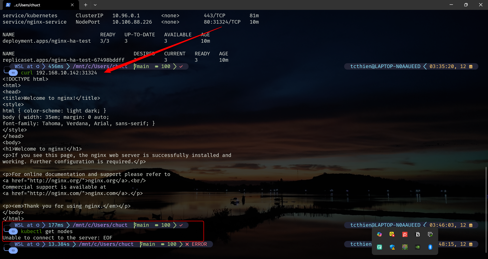

- Đúng theo spec: **Control-plane không hoạt động.**
    - kube-apiserver dùng etcd để đọc mọi thông tin cluster → Khi etcd mất quorum → kube-apiserver **không thể phục vụ request**
    - HAProxy/Keepalived vẫn hoạt động nhưng **API server không trả lời**
- Vì **data-plane hoạt động độc lập với control-plane → workload vẫn chạy**

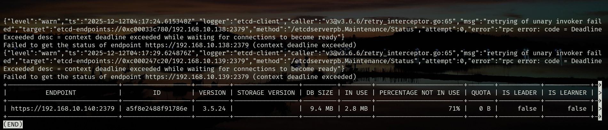

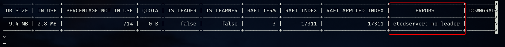

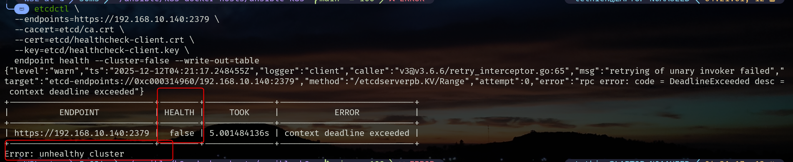

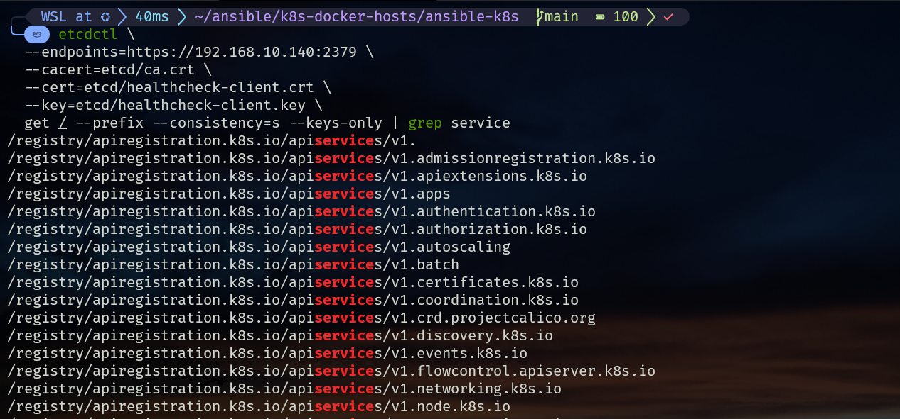

Trong lệnh có tham số `--consistency=s` (viết tắt của `serializable`). 

- **Linearizable (Mặc định - `l`):** Khi đọc, etcd node này (dù là Follower) phải liên hệ với Leader để xác nhận dữ liệu là mới nhất. Nếu mất kết nối với Leader, lệnh đọc sẽ thất bại.
- **Serializable (`s`):** Etcd được chỉ định đọc trực tiếp dữ liệu hiện có trong bộ nhớ **cục bộ (local store)** của node đó mà không cần hỏi Leader.
    - **Kết luận:** Việc lệnh chạy thành công với cờ `s` chứng tỏ nó đang lấy dữ liệu đang nằm ngay trên node `192.168.10.140`.

---

# **PHẦN 5 — RECOVERY**

**Objective:** Xác nhận cluster có thể phục hồi khi số lượng member trở lại đủ quorum.

---

## **1. Action: Bring Master Node #2 back online**

Bật lại master node 2

---

## **2. Verify Control-Plane Recovery**

Expected: Phải hoạt động lại ngay khi quorum (2/3) được khôi phục.

```bash
kubectl get nodes
```

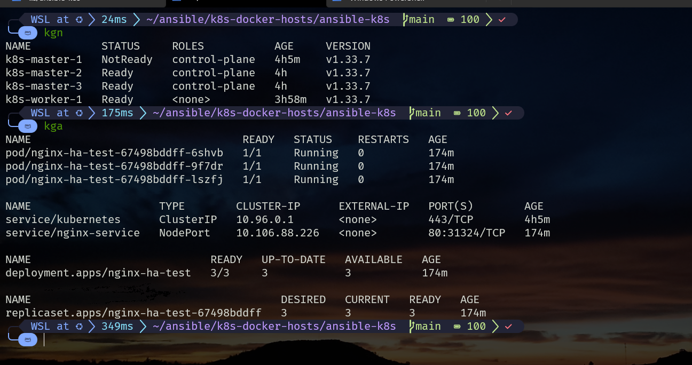

---

## **3. Verify Write Path Recovery**

```bash
kubectl scale deployment nginx-ha-test --replicas=5
```

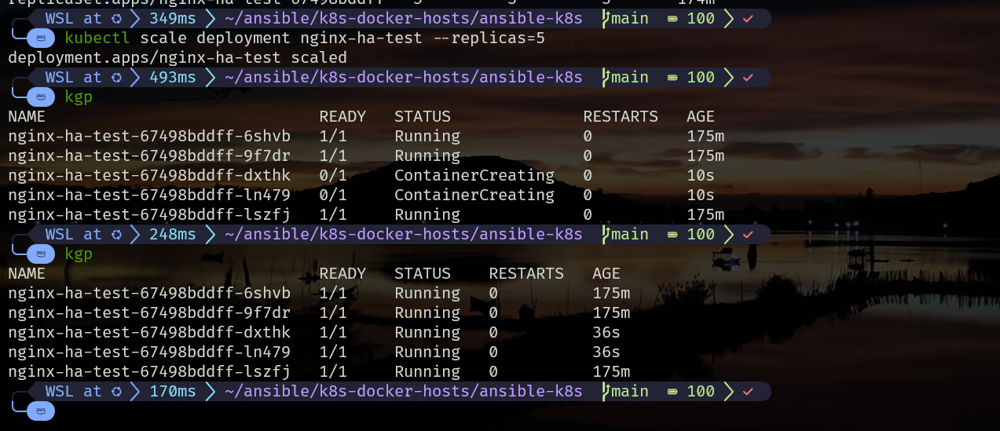

Scheduler tạo thêm Pod → cluster đã fully recovered.

---

# **PHẦN 6 — Kiểm thử Haproxy/KeepAlived**

🎯 **Mục tiêu**

- Kiểm tra **failover** VIP từ MASTER → BACKUP khi node Master lỗi.
- Kiểm tra **failback** BACKUP → MASTER khi Master phục hồi.
- Đảm bảo dịch vụ (HAProxy, API Server, hoặc bất kỳ service nào dùng VIP) **không bị gián đoạn dài**.

---

## **1. Kiểm tra trạng thái ban đầu (Baseline)**

### 1.1 SSH vào 2 node và kiểm tra trạng thái Keepalived

**Expected:**

- Keepalived = active (running)
- VIP 192.168.10.100 phải nằm trên card mạng của node 141.
- KHÔNG có VIP treen node 143

```bash
# Check which node owns the VIP
for node in 192.168.10.141 192.168.10.143; do
  echo "Checking VIP on $node:"
  ssh ha@$node "ip addr show | grep 192.168.10.100 || echo 'No VIP found'"
done

# Check HAProxy stats 
curl -I http://192.168.10.141:8404/stats
curl -I http://192.168.10.143:8404/stats
```

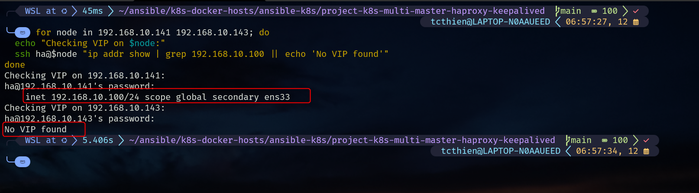

---

### 1.2 Kiểm tra VRRP role qua log

**Expected:**

- Node 141 = `MASTER`
- Node 143 = `BACKUP`

```bash
ssh ha@192.168.10.141 "systemctl status keepalived"
ssh ha@192.168.10.143 "systemctl status keepalived"
```

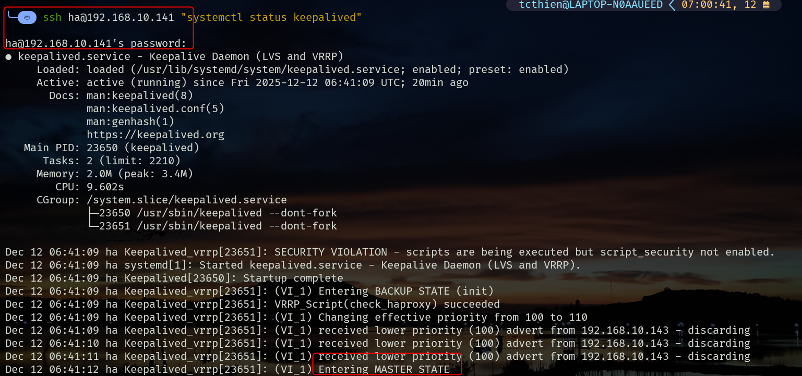

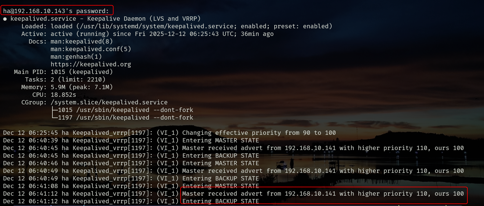

---

## 🔥 **2. SCENARIO 1 — FAILOVER (MASTER → BACKUP)**

**Mục tiêu:** Khi MASTER chết, VIP nhảy sang BACKUP

---

### 2.1 **Tắt node MASTER**

SSH từ node khác:

```bash
ssh ha@192.168.10.141 
sudo poweroff
```

---

### 2.2 **Kiểm tra failover tại node BACKUP**

```bash
ip a | grep 192.168.10.100
```

**Expected:**

- Node 143 *nhận được VIP*.
- Interface: thường là `eth0` hoặc `ens33`.

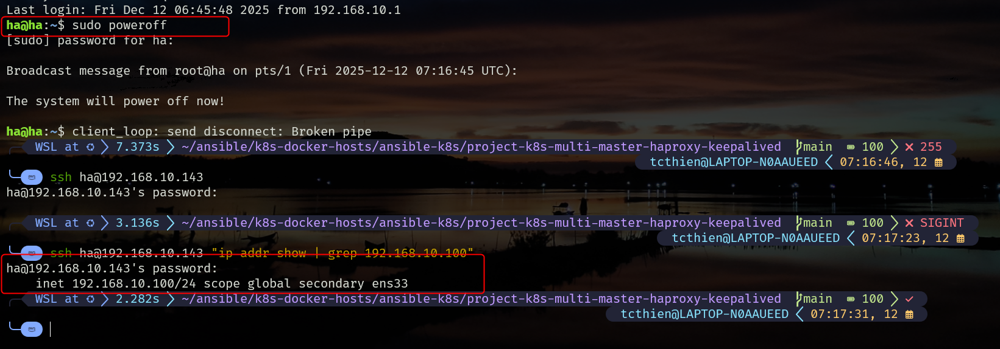

---

### 2.3 Kiểm tra Keepalived log trên BACKUP

```bash
journalctl -u keepalived -n 20
```

**Expected:**

- MASTER STATE

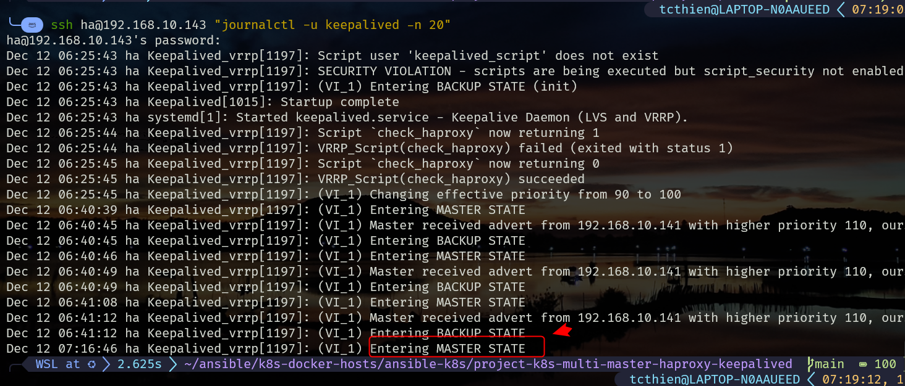

---

### 2.4 Kiểm tra kết nối dịch vụ (qua VIP)

Ping VIP:

```bash
ping -c4 192.168.10.100
```

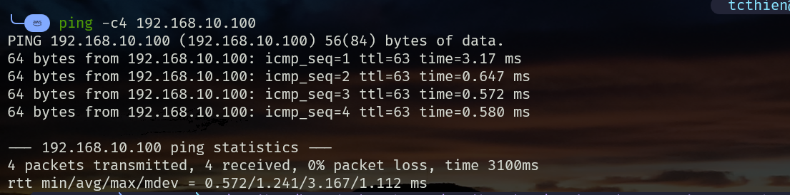

---

## 3. SCENARIO 2 — FAILBACK (BACKUP → MASTER)

### 3.1 Kiểm tra log trên MASTER

```bash
ssh ha@192.168.10.141 "systemctl status keepalived"
```

**Expected:**

```
MASTER STATE
```

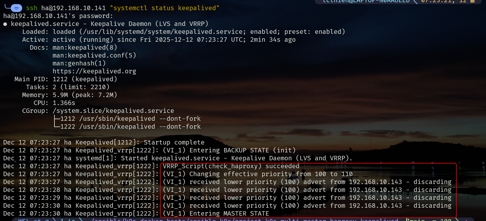

---

### 3.2 Kiểm tra VIP

```bash
#Trên MASTER
ip a | grep 192.168.10.100
```

**Expected:** VIP quay lại node 141.

---

```bash
#Trên BACKUP:
ip a | grep 192.168.10.100
```

**Expected:** Node 143 không còn giữ VIP.

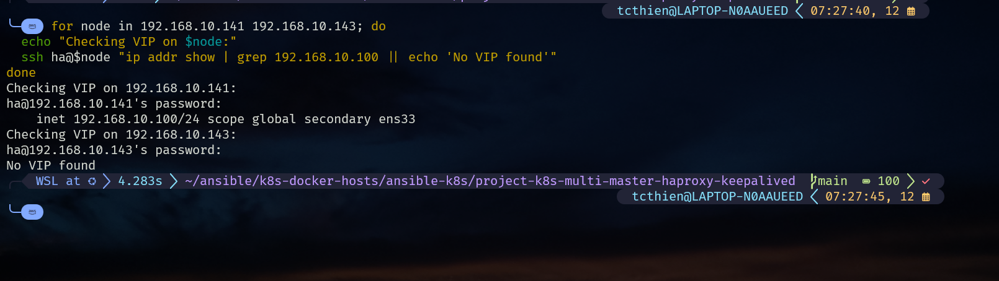

---

## 3.3 Kiểm tra dịch vụ sau failback

```bash
kubectl get no
kubectl get all
```

**Expected:**

- Dịch vụ vẫn liên tục.
- Không mất kết nối.

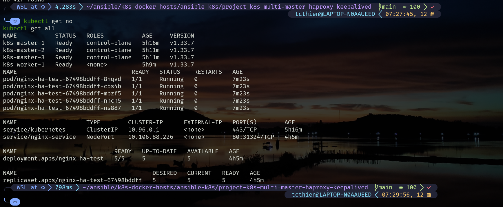

---